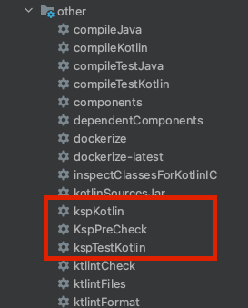

# iCure Data Stack
OSS version of the iCure Medical File Management software

iCureBackend is free software: you can redistribute it and/or modify
it under the terms of the GNU General Public License as published by
the Free Software Foundation, either version 2 of the License, or
(at your option) any later version.

You will find a copy of GNU General Public License in the LICENSE file in this repository.

To install compile and start:

```
git clone git@github.com:taktik/icure-backend.git
./gradlew :bootRun
```

if you wish to build & run this project using the IntelliJ idea, you'll have to run the kspKotlin gradle task before

## ⚠️ Migrating from Kotlin 1.4.32 to Kotlin 1.7.20

To build the OSS Version of the Kraken for Kotlin version 1.7.20 you have to following steps:

### Build and Run Using Gradle

On IntelliJ, go to `Preferences > Build, Execution, Deployment > Build Tools > Gradle` and set both `Build and run using` and `Run tests using` option to "Gradle"


### Run kspKotlin instead of kaptKotlin

On the IntelliJ Gradle menu, you will now have the `kspKotlin` task instead of the `kaptKotlin` task.<br>
This task will be automatically invoked during the build phase and will be skipped if the file that are needed for the automatic generation of classes were not modified.




## Naming convention in this project

For controllers, logic and DAOs:

| Action                        | API Name       | Method and path                                                                      |
|-------------------------------|----------------|--------------------------------------------------------------------------------------|
| Create an object              | createObject   | POST /rest/v?/object                                                                 |
| Create objects                | createObjects  | POST /rest/v?/object/batch                                                           |
| Modify an object              | modifyObject   | PUT /rest/v?/object                                                                  |
| Modify objects                | modifyObjects  | PUT /rest/v?/object/batch                                                            |
| Get an object by id           | getObject      | GET /rest/v?/object/:id                                                              |
| Get an object by other key    | getObjectByKey | GET /rest/v?/object/byKey/:key                                                       |
| Find objects using pagination | findObjectsBy  | GET or POST /rest/v?/object/byMainKey/:mainKey (may have extra query params or body) |
| List objects (no pagination)  | listObjectsBy  | GET or POST /rest/v?/object/byMainKey/:mainKey (may have extra query params or body) |
| Get objects by ids            | getObjects     | POST /rest/v?/object/batch (ids pass in body)                                        |
| Delete an object              | deleteObject   | DELETE /rest/v?/object/:id                                                           |
| Delete objects                | deleteObjects  | POST /rest/v?/object/delete/batch (ids pass in body)                                 |
